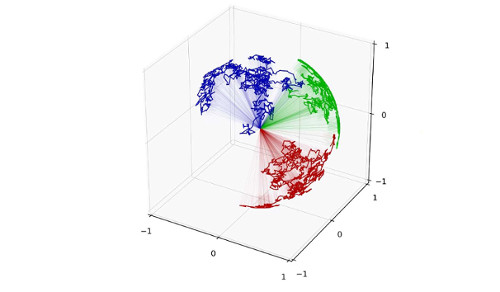

# Jax Geometry #

The code in this repository is based on the papers *Differential geometry and stochastic dynamics with deep learning numerics* [arXiv:1712.08364](https://arxiv.org/abs/1712.08364) and *Computational Anatomy in Theano* [arXiv:1706.07690](https://arxiv.org/abs/1706.07690).

The code is a reimplementation of the Theano Geometry library https://bitbucket.org/stefansommer/jaxgeometry/ replacing Theano with Jax https://github.com/google/jax.

### Who do I talk to? ###

Please contact Stefan Sommer *sommer@di.ku.dk*

### Installation Instructions ###

Please use Python 3.X.

#### pip:
Install jax, jaxlib, jupyter, matplotlib, sklearn:
```
pip install jax jaxlib jupyter matplotlib sklearn
```
Use e.g. a Python 3 virtualenv:
```
virtualenv -p python3 .
source bin/activate
pip install jax jaxlib jupyter matplotlib sklearn
```
If you don't use a virtual environment, make sure that you are actually using Python 3, e.g. use pip3 instead of pip.

Alternatively, use conda:
```
conda install -c conda-forge jaxlib
conda install -c conda-forge jax
```

Start jupyter notebook 
```
jupyter notebook
```

Your browser should now open with a list of the Jax Geometry notebooks in the main folder.

### Why Jax? ###
Some good discussions about the architectural differences between autodiff frameworks: https://www.assemblyai.com/blog/why-you-should-or-shouldnt-be-using-jax-in-2022/ and http://www.stochasticlifestyle.com/engineering-trade-offs-in-automatic-differentiation-from-tensorflow-and-pytorch-to-jax-and-julia/
